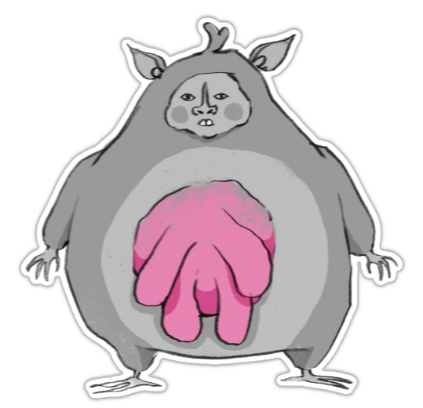

# Welcome to my githole

I'm an indie game developer who makes games in Godot. Most of my (somewhat) finished   work lives over on
[itch.io](https://scye155.itch.io) — this is where the behind-the-scenes stuff ends up.

<b>Feel free to rummage around.</b>

---

## Currently working on

### Milkmana

A spellcasting game built around hunting bovine creatures to then use their milk as fuel for spells.

---

## What I work with

- 🎮 [Godot](https://godotengine.org/) / GDScript
- 🎨 [Aseprite](https://www.aseprite.org/)
- 🗿 [Blender](https://www.blender.org/) (though rarely and quite poorly)
- 🎵 [FL Studio](https://www.image-line.com/)

---

## Play my games

🕹️ [scye155.itch.io](https://scye155.itch.io)

---

## Stats

